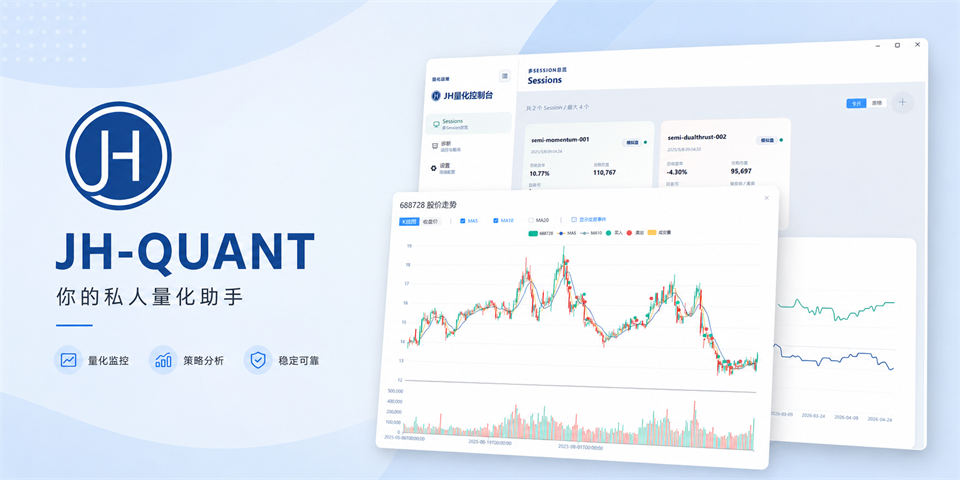
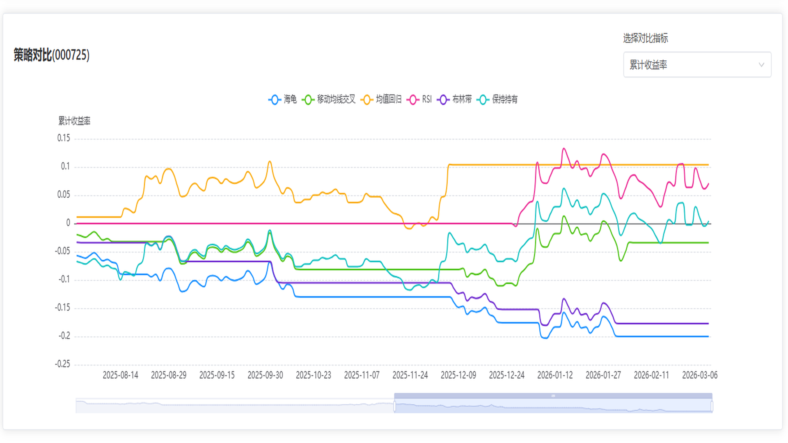
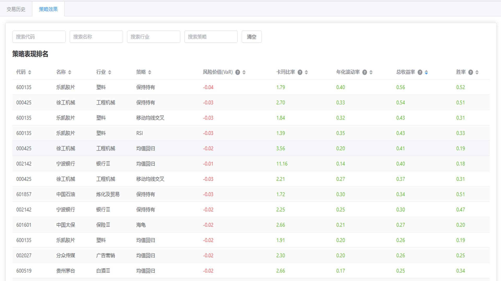
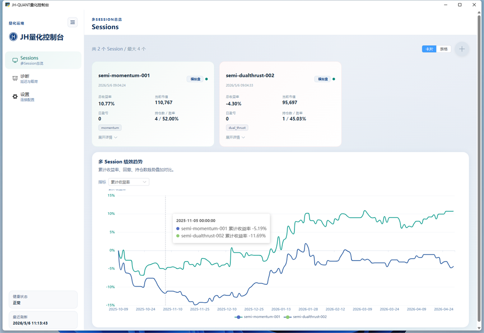

# JH_QUANT


量化交易研究与执行平台。支持：**免费数据获取**、**回测**、**因子计算**、 **模拟交易**、**组合优化**、**可视化仪表盘**

- **官网**: https://jiuhuang.xyz
- **文档**: https://doc.jiuhuang.xyz

## 模块

| 模块                           | 说明                                                 | 文档                              |
| ------------------------------ | ---------------------------------------------------- | --------------------------------- |
| [data](docs/data.md)           | 多种数据获取，兼容akshare和tushare数据类型及调用风格 | [README](docs/data/index.md)      |
| [trading](docs/trading.md)     | 交易运行层，模拟(实时)交易与会话编排                 | [README](docs/trading/index.md)   |
| [backtest](docs/backtest.md)   | 回测引擎，快速策略验证，多种内置策略                 | [README](docs/backtest/index.md)  |
| [factors](docs/factors.md)     | 因子计算，内置多种因子模型                           | [README](docs/factors/index.md)   |
| [dashboard](docs/dashboard.md) | PyWebView可视化仪表盘                                | [README](docs/dashboard/index.md) |

## 快速开始

### 安装

```bash
pip install jh_quant
```

### 数据获取

```python
import os
from jh_quant.data import JHData, DataTypes

jh = JHData(api_key=os.getenv("JIUHUANG_API_KEY"))
stock_price = jh.get_data(
    DataTypes.AK_STOCK_ZH_A_HIST_QFQ,  #akshare日线前复权数据
    symbol="000001",
    start="2025-01-01",
    end="2025-12-10",
)
```

**重要**
> `jh_quant` 仅做了对 [akshare](https://github.com/akfamily/akshare) 数据类型的兼容，数据真实来源为：[JiuHuang API](https://jiuhuang.xyz)

### 策略回测

```python
from jh_quant.data import JHData, DataTypes
from jh_quant.backtest import (
    backtest,
    StrategyTurtle,
    StrategyMovingAverageCrossover,
    StrategyBuyAndHold,
)
from jh_quant.dashboard import display_backtesting
# 1. 准备数据
jh = JHData()
stock_price = jh.get_data(
    DataTypes.AK_STOCK_ZH_A_HIST_QFQ,
    symbol="000001,600519,300750",
    start="2025-01-01",
    end="2026-05-07",
)
stock_info = jh.get_data(DataTypes.AK_STOCK_INDIVIDUAL_INFO_EM)

# 2. 定义策略
strategies = {
    "海龟策略": StrategyTurtle(entry_window=20, exit_window=10),
    "均线交叉": StrategyMovingAverageCrossover(short_window=12, long_window=24),
    "买入持有": StrategyBuyAndHold(),
}

# 3. 执行回测
trading_hist, backtest_perf = backtest(
    strategies=strategies,
    price_data=stock_price,
    stock_info=stock_info,
)

display_backtesting( trading_hist, backtest_perf)
```

**回测仪表盘预览**

| 策略对比 | 策略分布 |
| -------- | -------- |
|  |  |

| 交易历史 | 策略排名 |
| -------- | -------- |
|  |  |

### 实时模拟交易

**jh_quant**支持同时开启多个模拟交易会话，每个会话对应一个模拟账户, 下面是示例运行:

```bash
python run_paper.py
```
*run_paper.py*的完整代码参考本repo根目录的[run_paper.py](./run_paper.py)

在回填模式下（可以通过`enable_backfill=False`关闭），会完成历史交易模拟，并在本地开启服务

**开启控制台仪表盘**
开启本地服务之后, 可以通过如下代码开启控制台仪表盘
```python
from jh_quant.dashboard import display_trading

display_trading()
```



## License

This project is licensed under the AGPL-3.0 License - see the [LICENSE](LICENSE) file for details.
