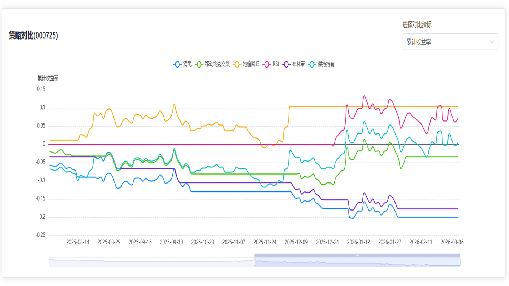
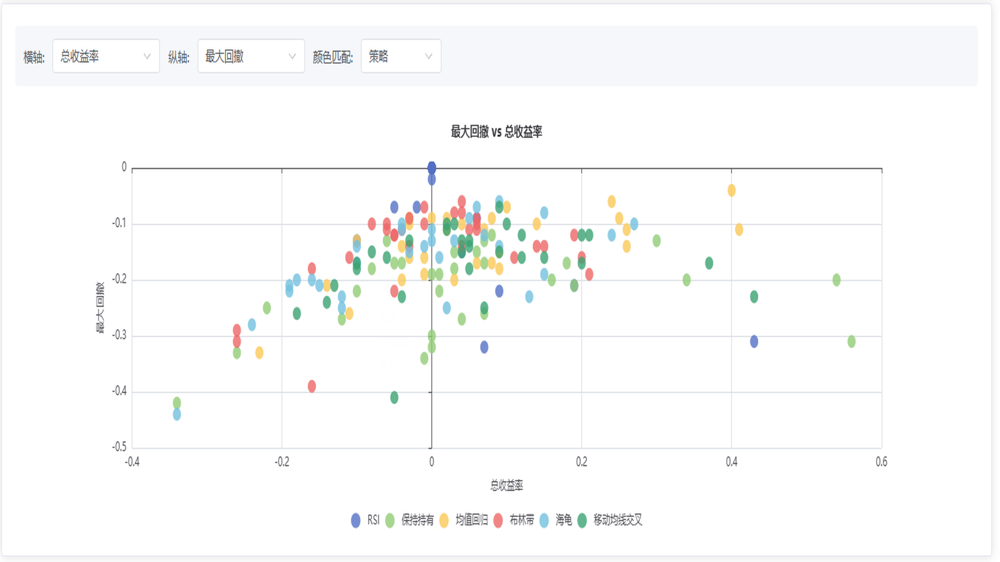
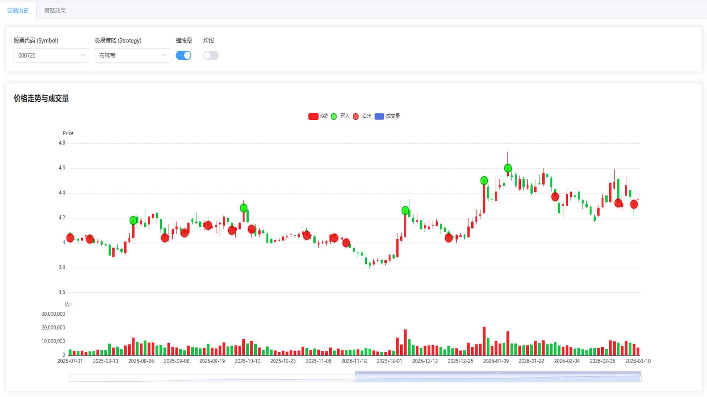
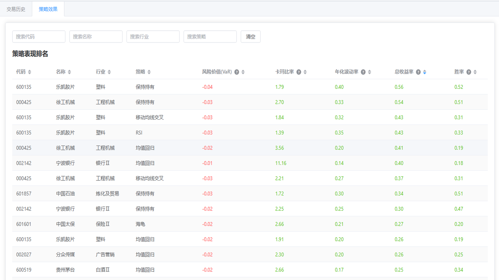

# JH_QUANT


https://github.com/user-attachments/assets/24b8017f-e95e-406d-876f-ac13440b2c1f


量化交易研究与执行平台。支持：**免费数据获取**、**回测**、**因子计算**、**实盘/模拟交易**、**组合优化**、**可视化仪表盘**。

- **官网**: https://jiuhuang.xyz
- **文档**: https://doc.jiuhuang.xyz

## 快速开始

### 安装

```bash
pip install jh_quant
```

### 数据获取

```python
import os
from jh_quant.data import JHData, DataTypes

jh = JHData(api_key=os.getenv("JIUHUANG_API_KEY"))
stock_price = jh.get_data(
    DataTypes.TS_DAILY_QFQ,  # tushare A 股日线前复权
    ts_code="000001.SZ",
    start="2025-01-01",
    end="2025-12-10",
)
```

> 暂时只支持A股相关数据获取

#### 数据兼容

兼容 `tushare` 调用风格：

```python
from jh_quant.data.data_providers import tushare as ts

df = ts.daily(  # 或者完全类似tushare: ts.pro.daily()
    ts_code="000001.SZ",
    start_date="20240101",
    end_date="20241231",
)

pro_df = ts.pro.pro_bar(
    ts_code="000001.SZ",
    start_date="20240101",
    end_date="20241231",
    asset="E",
    freq="D",
   # fields="ts_code,trade_date,open,high,low,close,vol,amount", # 支持筛选字段
)
```

兼容 `akshare` 调用风格：

```python
from jh_quant.data.data_providers import akshare as ak

df = ak.stock_zh_a_hist(
    symbol="000001",
    period="daily",
    start_date="20240101",
    end_date="20241231",
    adjust="qfq",
)
```

### 策略回测

```python
from jh_quant.data import JHData, DataTypes, to_backtest_price_frame
from jh_quant.backtest import (
    backtest,
    StrategyTurtle,
    StrategyMovingAverageCrossover,
    StrategyBuyAndHold,
)
from jh_quant.dashboard import display_backtesting

# 1. 准备数据
jh = JHData()
stock_price = jh.get_data(
    DataTypes.TS_DAILY_QFQ,
    ts_code="000001.SZ,600519.SH,300750.SZ",
    start="2025-01-01",
    end="2026-05-07",
)
stock_price = to_backtest_price_frame(stock_price)

# 2. 定义策略
strategies = {
    "海龟策略": StrategyTurtle(entry_window=20, exit_window=10),
    "均线交叉": StrategyMovingAverageCrossover(short_window=12, long_window=24),
    "买入持有": StrategyBuyAndHold(),
}

# 3. 执行回测
trading_hist, backtest_perf = backtest(
    strategies=strategies,
    price_data=stock_price,
)

display_backtesting(trading_hist, backtest_perf)
```

**回测仪表盘预览**

| 策略对比                                      | 策略分布                                   |
| --------------------------------------------- | ------------------------------------------ |
|  |  |

| 交易历史                                        | 策略排名                                      |
| ----------------------------------------------- | --------------------------------------------- |
|  |  |

## 交易 Trading

### 两种运行模式

- `paper`
  使用 `PaperBroker` 模拟成交，可配合 `realtime` 或 `backfill` 两种时钟模式。
- `live`
  使用显式配置的真实 broker，例如 `XtQuantBroker`。`live` 只允许 `realtime`，不会执行 backfill。
  > live模式需要进一步完善

#### Paper 与 Live 的核心区别

| 维度       | Paper                    | Live                    |
| ---------- | ------------------------ | ----------------------- |
| Broker     | `PaperBroker` 自动创建   | 必须显式配置真实 broker |
| 时钟模式   | `realtime` / `backfill`  | 仅 `realtime`           |
| 成交语义   | 本地模拟成交             | 真实柜台 / 终端成交     |
| 持仓与资金 | 本地状态机维护           | 以 broker 查询结果为准  |
| 回填       | 支持                     | 不支持                  |
| 适用场景   | 策略验证、影子组合、回放 | 实盘执行                |

### 命令行接口

> 旧版 `uv run python run_paper.py` / `run_live.py` 已废弃，请统一使用 `uv run jh-quant <subcommand>`。

#### 模拟交易 `jh-quant paper`

```bash
uv run jh-quant paper
```

`paper` 默认使用 `paper-compare` 模板，自动创建两个并行模拟场景：

- `paper-turtle`：海龟策略基准场景。
- `paper-momentum`：默认用户策略场景。

当使用 `paper-compare` 且用户只传入新策略时，bootstrap 会自动保留 `turtle` 作为基准场景。

默认股票池偏向半导体 / AI 芯片链观察池，便于演示并行策略比较。默认行情 backend 是 `tushare`。

##### paper 全部选项

| 选项                     | 类型  | 默认值              | 说明                                                                                                                                                                                                                                       |
| ------------------------ | ----- | ------------------- | ------------------------------------------------------------------------------------------------------------------------------------------------------------------------------------------------------------------------------------------ |
| `--template`             | str   | `paper-compare`     | Bootstrap 启动模板。可选: `paper-basic`, `paper-compare`。环境变量: `TRADING_TEMPLATE`                                                                                                                                                     |
| `--backend`              | str   | `tushare`           | 行情数据后端。可选: `tushare`, `akshare`。环境变量: `TRADING_BACKEND`                                                                                                                                                                      |
| `--strategy`             | str   | `momentum`          | 策略名称，多个用逗号分隔。可选: `bollinger_bands`, `breakout`, `buy_and_hold`, `dual_thrust`, `mean_reversion`, `momentum`, `moving_average_crossover`, `rsi`, `turtle`, `volume_divergence`, `volume_trend`。环境变量: `TRADING_STRATEGY` |
| `--symbols`              | str   | 半导体/AI芯片观察池 | 股票池纯数字代码，逗号分隔（如 `688041,688256`）。环境变量: `TRADING_SYMBOLS`                                                                                                                                                              |
| `--host`                 | str   | `127.0.0.1`         | API 服务绑定地址。环境变量: `TRADING_HOST`                                                                                                                                                                                                 |
| `--port`                 | int   | `8000`              | API 服务端口。环境变量: `TRADING_PORT`                                                                                                                                                                                                     |
| `--db-path`              | str   | `trade_paper.db`    | SQLite 数据库文件路径。环境变量: `TRADING_DB_PATH`                                                                                                                                                                                         |
| `--initial-capital`      | float | `100000`            | 模拟盘初始资金（元）。环境变量: `TRADING_INITIAL_CAPITAL`                                                                                                                                                                                  |
| `--cron`                 | str   | `0 14 * * 1-5`      | 交易循环 cron 表达式（5 段式），默认交易日 14:00                                                                                                                                                                                           |
| `--backfill-start`       | str   | 无（默认 180 天前） | 回填起始日期 `YYYY-MM-DD`。环境变量: `TRADING_BACKFILL_START`                                                                                                                                                                              |
| `--no-backfill`          | flag  | 关闭                | 关闭回填模式，仅实时行情。也可设 `TRADING_ENABLE_BACKFILL=0`                                                                                                                                                                               |
| `--no-dashboard`         | flag  | 关闭                | 只启动 API，不弹出 Dashboard。也可设 `TRADING_SHOW_DASHBOARD=0`                                                                                                                                                                            |
| `--dashboard-refresh-ms` | int   | `15000`             | Dashboard 数据刷新间隔（毫秒）                                                                                                                                                                                                             |
| `--no-auto-start`        | flag  | 关闭                | 只创建 session，不自动启动调度器                                                                                                                                                                                                           |

##### paper 启动示例

```bash
# 默认启动（半导体观察池，tushare 行情）
jh-quant paper

# 指定策略
jh-quant paper --strategy turtle,momentum

# 自定义股票池 + 初始资金
jh-quant paper --symbols 688041,688256 --initial-capital 200000

# 纯 API 模式（不弹出 Dashboard）
jh-quant paper --no-dashboard --port 8080

# 关闭回填，仅实时行情
jh-quant paper --no-backfill
```

#### 实盘交易 `jh-quant live`

```bash
uv run jh-quant live
```

`live` 使用 `live-basic` 模板创建实盘 session，broker 使用 xtquant / MiniQMT。运行前需要配置：

实盘模式必须设置的环境变量：

```bash
MINIQMT_USERDATA_DIR=...       # MiniQMT userdata 目录
MINIQMT_STOCK_ACCOUNT=...      # 股票账户号
MINIQMT_TRADER_SESSION_ID=...  # 交易会话 ID（可选）
```

##### live 全部选项

| 选项                     | 类型 | 默认值              | 说明                                                                                                                                                                                                                                       |
| ------------------------ | ---- | ------------------- | ------------------------------------------------------------------------------------------------------------------------------------------------------------------------------------------------------------------------------------------ |
| `--template`             | str  | `live-basic`        | Bootstrap 启动模板。环境变量: `TRADING_TEMPLATE`                                                                                                                                                                                           |
| `--backend`              | str  | `tushare`           | 行情数据后端。可选: `tushare`, `akshare`, `xquant`。环境变量: `TRADING_BACKEND`                                                                                                                                                            |
| `--strategy`             | str  | `momentum`          | 策略名称，多个用逗号分隔。可选: `bollinger_bands`, `breakout`, `buy_and_hold`, `dual_thrust`, `mean_reversion`, `momentum`, `moving_average_crossover`, `rsi`, `turtle`, `volume_divergence`, `volume_trend`。环境变量: `TRADING_STRATEGY` |
| `--symbols`              | str  | 半导体/AI芯片观察池 | 股票池纯数字代码，逗号分隔（如 `688041,688256`）。环境变量: `TRADING_SYMBOLS`                                                                                                                                                              |
| `--host`                 | str  | `127.0.0.1`         | API 服务绑定地址。环境变量: `TRADING_HOST`                                                                                                                                                                                                 |
| `--port`                 | int  | `8000`              | API 服务端口。环境变量: `TRADING_PORT`                                                                                                                                                                                                     |
| `--db-path`              | str  | `trade_live.db`     | SQLite 数据库文件路径。环境变量: `TRADING_DB_PATH`                                                                                                                                                                                         |
| `--cron`                 | str  | `0 14 * * 1-5`      | 交易循环 cron 表达式（5 段式），默认交易日 14:00                                                                                                                                                                                           |
| `--no-dashboard`         | flag | 关闭                | 只启动 API，不弹出 Dashboard。也可设 `TRADING_SHOW_DASHBOARD=0`                                                                                                                                                                            |
| `--dashboard-refresh-ms` | int  | `15000`             | Dashboard 数据刷新间隔（毫秒）                                                                                                                                                                                                             |
| `--no-auto-start`        | flag | 关闭                | 只创建 session，不自动启动调度器                                                                                                                                                                                                           |

> **注意**: `live` 模式没有 `--initial-capital` 选项（资金以 broker 查询为准），也不支持回填（始终保持 `realtime` 时钟）。

##### live 启动示例

```bash
# 默认启动
jh-quant live

# 指定策略 + 自定义股票池
jh-quant live --strategy turtle --symbols 688041,688256

# 使用 xtquant 行情
jh-quant live --backend xquant --strategy turtle,momentum

# 纯 API 模式
jh-quant live --no-dashboard --port 8080
```

### 控制台仪表盘

bootstrap 默认会先启动 API，然后自动调用 `display_trading()` 打开控制台仪表盘。只想启动 API 时可以使用：

```bash
uv run jh-quant paper --no-dashboard
uv run jh-quant live --no-dashboard
```

手动打开仪表盘仍然支持：

```python
from jh_quant.dashboard import display_trading

# 如果你修改了端口，需要显式传入 port 参数
display_trading()
```

## AI 开发助手 (Skill)

本项目提供跨平台 AI Coding Agent 的 Skill 文件，让你的 AI 助手以 jh_quant 专家的模式工作。

### 安装

| 平台 | 安装方式 |
|------|---------|
| **Claude Code** | 复制 `skills/jh-quant/` → `<project>/.claude/skills/jh-quant/` |
| **Codex (OpenAI)** | 复制 `skills/jh-quant/` → `<project>/.codex/skills/jh-quant/` |
| **Hermes / OpenClaw** | 开箱即用（自动识别项目根目录 `skills/` 文件夹） |

#### 安装到项目（仅当前项目生效）

```bash
# macOS / Linux
cp -r skills/jh-quant /path/to/your-project/.claude/skills/

# Windows (PowerShell)
Copy-Item -Recurse skills/jh-quant/ C:\path\to\your-project\.claude\skills\
```

#### 安装到用户目录（所有项目生效）

```bash
# --- macOS / Linux ---
# Claude Code
cp -r skills/jh-quant ~/.claude/skills/
# Codex
cp -r skills/jh-quant ~/.codex/skills/

# --- Windows (PowerShell) ---
# Claude Code
Copy-Item -Recurse skills/jh-quant/ $env:USERPROFILE\.claude\skills\
# Codex
Copy-Item -Recurse skills/jh-quant/ $env:USERPROFILE\.codex\skills\
```

### 使用

安装后，AI 助手会自动在相关任务中激活该 skill。你也可以显式调用：

- **Claude Code**：`/jh-quant 帮我实现一个新的策略并回测`
- **Codex**：`$jh-quant 帮我实现一个新的策略并回测`
- **Hermes / OpenClaw**：`/jh-quant 帮我实现一个新的策略并回测`

Skill 内容详见 [skills/jh-quant/](skills/jh-quant/)。

## 更多说明：

- [数据同步（sync）](docs/sync/index.md) — 同步本地数据到远程数据库后，配合 [手机 App](https://github.com/jiuhuang-asset/jh_quant_rn_app) 随时随地查看投资表现
- [Trading 快速开始](docs/trading/quickstart.md)
- [Bootstrap 模板](docs/trading/bootstrap.md)
- [高级自定义运行](docs/trading/advanced-usage.md)

## License

This project is licensed under the AGPL-3.0 License. See [LICENSE](LICENSE) for details.
