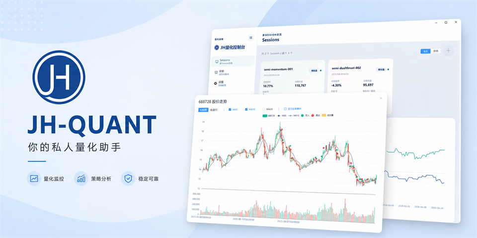

# JH_QUANT



量化交易研究与执行平台。支持：**免费数据获取**、**回测**、**因子计算**、**实盘/模拟交易**、**组合优化**、**可视化仪表盘**。

- **官网**: https://jiuhuang.xyz
- **文档**: https://doc.jiuhuang.xyz

## 快速开始

### 安装

```bash
pip install jh_quant
```

### 数据获取

```python
import os
from jh_quant.data import JHData, DataTypes

jh = JHData(api_key=os.getenv("JIUHUANG_API_KEY"))
stock_price = jh.get_data(
    DataTypes.TS_DAILY_QFQ,  # tushare A 股日线前复权
    ts_code="000001.SZ",
    start="2025-01-01",
    end="2025-12-10",
)
```
> 暂时只支持A股相关数据获取

#### 数据兼容
兼容 `tushare` 调用风格：
```python
from jh_quant.data.data_providers import tushare as ts

df = ts.daily(
    ts_code="000001.SZ",
    start_date="20240101",
    end_date="20241231",
)

pro_df = ts.pro.pro_bar(
    ts_code="000001.SZ",
    start_date="20240101",
    end_date="20241231",
    asset="E",
    freq="D",
)
```
兼容 `akshare` 调用风格：

```python
from jh_quant.data.data_providers import akshare as ak

df = ak.stock_zh_a_hist(
    symbol="000001",
    period="daily",
    start_date="20240101",
    end_date="20241231",
    adjust="qfq",
)
```
### 策略回测

```python
from jh_quant.data import JHData, DataTypes, to_backtest_price_frame
from jh_quant.backtest import (
    backtest,
    StrategyTurtle,
    StrategyMovingAverageCrossover,
    StrategyBuyAndHold,
)
from jh_quant.dashboard import display_backtesting

# 1. 准备数据
jh = JHData()
stock_price = jh.get_data(
    DataTypes.TS_DAILY_QFQ,
    ts_code="000001.SZ,600519.SH,300750.SZ",
    start="2025-01-01",
    end="2026-05-07",
)
stock_price = to_backtest_price_frame(stock_price)

# 2. 定义策略
strategies = {
    "海龟策略": StrategyTurtle(entry_window=20, exit_window=10),
    "均线交叉": StrategyMovingAverageCrossover(short_window=12, long_window=24),
    "买入持有": StrategyBuyAndHold(),
}

# 3. 执行回测
trading_hist, backtest_perf = backtest(
    strategies=strategies,
    price_data=stock_price,
)

display_backtesting(trading_hist, backtest_perf)
```

**回测仪表盘预览**

| 策略对比 | 策略分布 |
| -------- | -------- |
|  |  |

| 交易历史 | 策略排名 |
| -------- | -------- |
|  |  |

## 交易 Trading

`jh_quant.trading` 现在按实盘语义组织，核心边界如下：

- `market_data`: 历史数据、实时快照、交易日历
- `signal`: 信号聚合与候选生成
- `portfolio`: 组合优化、权重与 rebalance 计划
- `broker`: 模拟或实盘执行通道
- `session`: `paper/live` 模式、`realtime/backfill` 时钟、调度与运行态

### 两种运行模式

- `paper`
  使用 `PaperBroker` 模拟成交，可配合 `realtime` 或 `backfill` 两种时钟模式。
- `live`
  使用显式配置的真实 broker，例如 `XtQuantBroker`。`live` 只允许 `realtime`，不会执行 backfill。

### 执行链路

#### Paper 模式（模拟交易）

```text
+---------------------------+
|   Scheduler / run_once    |
+-------------+-------------+
              |
              v
+---------------------------+
|       SessionRunner       |
+-------------+-------------+
              |
              v
+---------------------------+
| SessionCycleCoordinator   |
+-------------+-------------+
              |
              v
+-------------------------+      +-------------------------+
|   SelectionProvider     |----->|   MarketDataService     |
+-------------+-----------+      +-------------+-----------+
              |                                |
              +----------------+---------------+
                               |
                               v
                  +---------------------------+
                  | Signal / Portfolio Runtime|
                  +-------------+-------------+
                                |
                                v
                  +---------------------------+
                  |      TradingEngine        |
                  +-------------+-------------+
                                |
                                v
                  +---------------------------+
                  |       PaperBroker         |
                  +-------------+-------------+
                                |
                                v
                  +---------------------------+
                  | Persistence + Runtime State|
                  +-------------+-------------+
                                |
                                v
                  +---------------------------+
                  |      Dashboard / API      |
                  +---------------------------+
```

说明：

- `paper+realtime` 会直接使用当前可用的历史/实时行情运行模拟成交。
- `paper+backfill` 会先通过 `ReferenceTimeAware` 数据源逐日推进，再进入同一套模拟成交链路。
- 成交、持仓、日度快照都落到本地 persistence，方便复盘和对比。

#### Live 模式 （实盘交易）

```text
+---------------------------+
|   Scheduler / run_once    |
+-------------+-------------+
              |
              v
+---------------------------+
|      SessionRunner *      |
+-------------+-------------+
              |
              v
+---------------------------+
| SessionCycleCoordinator * |
+-------------+-------------+
              |
              v
+-------------------------+      +-------------------------+
|   SelectionProvider     |----->|   MarketDataService     |
+-------------+-----------+      +-------------+-----------+
              |                                |
              +----------------+---------------+
                               |
                               v
                  +---------------------------+
                  | Signal / Portfolio Runtime|
                  +-------------+-------------+
                                |
                                v
                  +---------------------------+
                  |      TradingEngine        |
                  +-------------+-------------+
                                |
                                v
                  +---------------------------+
                  |  XtQuantBroker / Broker * |
                  +-------------+-------------+
                                |
                                v
                  +---------------------------+
                  |MiniQMT / Broker Terminal *|
                  +-------------+-------------+
                                |
                                v
                  +---------------------------+
                  | Persistence + Runtime State|
                  +-------------+-------------+
                                |
                                v
                  +---------------------------+
                  |      Dashboard / API      |
                  +---------------------------+
```

> `*` 表示相对 `paper` 模式存在核心语义差异的节点。

说明：

- `live` 模式必须显式指定 broker，不会自动兜底成模拟账户。
- `live` 模式下会强制跳过 backfill，只跑实时时钟。
- 当日定价可以继续走统一的 `MarketDataService`，但最终下单与账户状态以真实 broker 为准。
- 当前内置的实盘 broker 为 `XtQuantBroker`，需要本地安装并运行 `MiniQMT`。

### Paper 与 Live 的核心区别

| 维度 | Paper | Live |
| --- | --- | --- |
| Broker | `PaperBroker` 自动创建 | 必须显式配置真实 broker |
| 时钟模式 | `realtime` / `backfill` | 仅 `realtime` |
| 成交语义 | 本地模拟成交 | 真实柜台 / 终端成交 |
| 持仓与资金 | 本地状态机维护 | 以 broker 查询结果为准 |
| 回填 | 支持 | 不支持 |
| 适用场景 | 策略验证、影子组合、回放 | 实盘执行 |

### 示例入口

#### 模拟交易

```bash
uv run python run_paper.py
```

`run_paper.py` 默认使用 `paper-compare` 模板，自动创建两个并行模拟场景：

- `paper-turtle`：海龟策略基准场景。
- `paper-momentum`：默认用户策略场景。

可以通过 `--strategy` 指定一个或多个策略，多个策略用英文逗号分隔：

```bash
uv run python run_paper.py --strategy rsi
uv run python run_paper.py --strategy turtle,momentum
```

当使用 `paper-compare` 且用户只传入新策略时，bootstrap 会自动保留 `turtle` 作为基准场景。

默认股票池偏向半导体 / AI 芯片链观察池，便于演示并行策略比较。默认行情 backend 是 `tushare`，当天实时行情暂用 AkShare 合并。

> 运行 uv run python run_paper.py --help 查看完整参数说明。

#### 实盘

```bash
uv run python run_live.py
```

`run_live.py` 使用 `live-basic` 模板创建实盘 session，broker 使用 xtquant / MiniQMT。运行前需要配置：

实盘模式常用环境变量：

```bash
MINIQMT_USERDATA_DIR=...
MINIQMT_STOCK_ACCOUNT=...
MINIQMT_TRADER_SESSION_ID=...
```

实盘行情 backend 可选：

```bash
uv run python run_live.py --backend tushare --strategy turtle
uv run python run_live.py --backend xquant --strategy turtle,momentum
```

> 运行 uv run python run_live.py --help 查看完整参数说明。

### 控制台仪表盘

bootstrap 默认会先启动 API，然后自动调用 `display_trading()` 打开控制台仪表盘。只想启动 API 时可以使用：

```bash
uv run python run_paper.py --no-dashboard
```

手动打开仪表盘仍然支持：

```python
from jh_quant.dashboard import display_trading

# 如果你修改了 run_paper.py 中的端口，需要显式传入 port 参数
display_trading()
```


更多说明：

- [Trading 快速开始](docs/trading/quickstart.md)
- [Bootstrap 模板](docs/trading/bootstrap.md)
- [高级自定义运行](docs/trading/advanced-usage.md)


## License

This project is licensed under the AGPL-3.0 License. See [LICENSE](LICENSE) for details.
